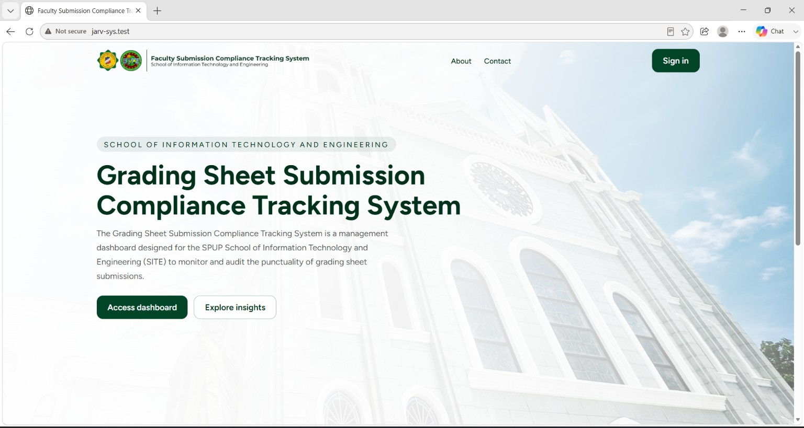
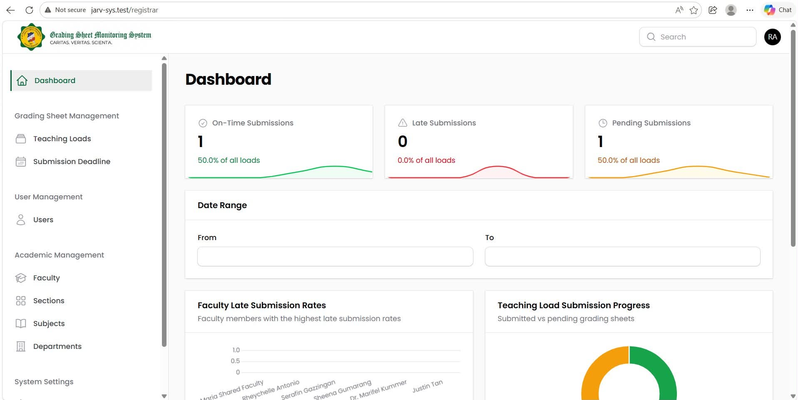
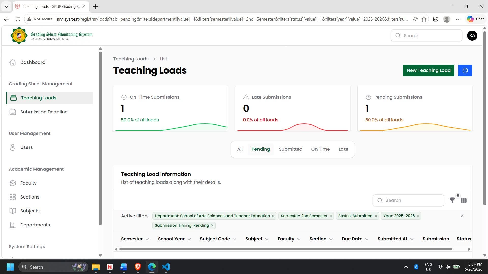
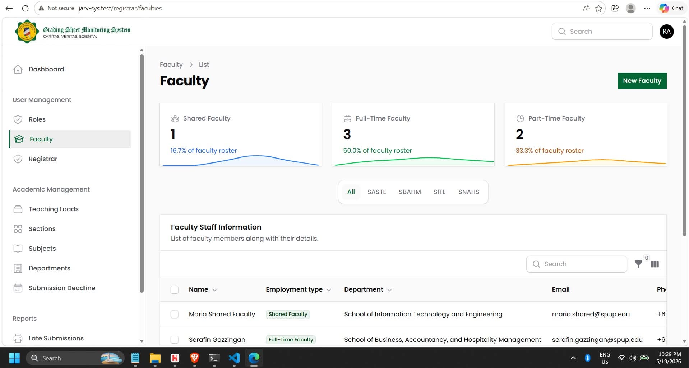

    

An application developed to help the dean monitor faculty grading sheet submissions and identify late or missing submissions. The system provides centralized faculty and teaching load management, while its dashboard presents report metrics that evaluate submission compliance and help the dean monitor faculty performance. 

### Dashboard

The Dashboard provides an overview of submission compliance through report metrics. It allows the dean to quickly identify late and missing submissions and evaluate submission performance without manually reviewing individual records.

### Faculty Management

The Faculty Management section allows administrators to manage faculty information used by the system. By keeping faculty records organized in one place, the system makes it easier to maintain accurate information and associate grading sheet submissions with the appropriate faculty members.

### Teaching Loads

The Teaching Loads section manages faculty teaching assignments and curriculum-related information. This provides the system with the necessary information to determine the grading sheets expected from each faculty member and helps establish which submissions need to be monitored.

